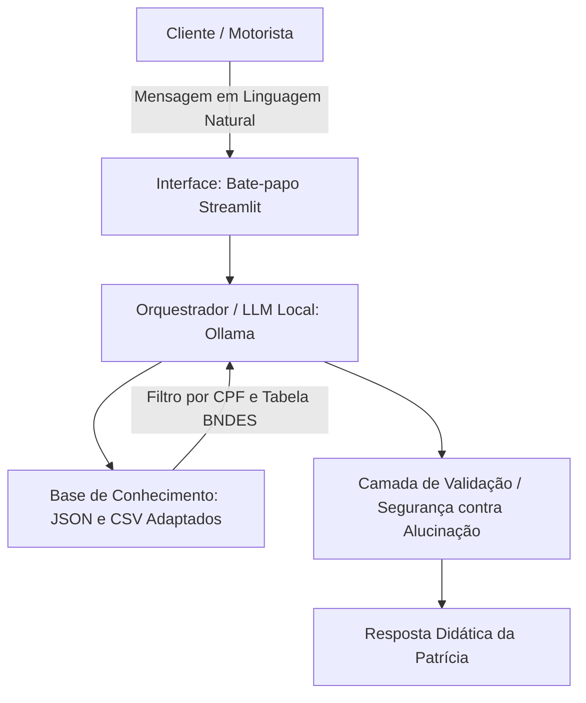

# Agente de IA Conversacional — Programa Move Brasil 2026

Este repositório contém a solução completa para um agente de Inteligência Artificial focado em esclarecer dúvidas e guiar motoristas autônomos no processo de aquisição de crédito veicular sustentável através do programa federal **Move Brasil 2026**.

A solução foi projetada com foco em acessibilidade e segurança, utilizando uma interface amigável integrada a um modelo de linguagem (LLM) executado de forma 100% local.

---

## 👤 A Persona: Patrícia

A **Patrícia** é uma assistente virtual focada em inclusão e educação financeira. 
* **Tom de Voz:** Informal, acolhedor e de fácil entendimento.
* **Linguagem Popular:** Traduz jargões bancários (como amortização e carência) para expressões simples do dia a dia (como "tempo para pagar" e "meses de folga").
* **Abordagem Didática:** Adapta-se ao grau de instrução de cada motorista, garantindo que o usuário compreenda as regras e os critérios do BNDES sem se sentir julgado.

---

## 🛠️ Arquitetura e Componentes

O agente opera sob uma infraestrutura ágil, local e segura, dividida nos seguintes blocos:



### Tecnologias e Estrutura de Pastas

* **Interface (Streamlit):** Web app interativo focado na usabilidade, simulando um chat direto com a Patrícia.
* **Orquestração e LLM (Ollama + Llama 3):** Execução do modelo de linguagem em ambiente local, garantindo privacidade total dos dados e custo zero de infraestrutura.
* **Base de Conhecimento (Pandas + JSON):** Dados mockados que simulam um ambiente financeiro real integrado com as regras do programa.

```text
├── data/                       # Base de Conhecimento (Arquivos de Dados)
│   ├── perfil_usuario.json     # Segmentação do motorista (tempo de app, corridas, etc.)
│   ├── produtos_financeiros.json # Regras oficiais, carências e juros do governo
│   ├── transacoes.csv          # Histórico de contratos e parcelas ativas
│   └── historico_atendimento.csv # Contexto de atendimentos anteriores
└── src/                        # Código-fonte da Aplicação
    ├── app.py                  # Interface visual do Chatbot
    ├── agente.py               # Lógica do agente e engenharia de prompts
    └── config.py               # Configurações do ambiente local

```

---

## 🛡️ Segurança e Estratégias Anti-Alucinação

Para garantir a confiabilidade das simulações financeiras oferecidas pela Patrícia, foram aplicadas as seguintes travas técnicas:

* [x] **Fidelidade Estrita à Base:** O agente utiliza técnicas de *Few-Shot Prompting* que delimitam estritamente o escopo das respostas, forçando o modelo a admitir ignorância caso a informação não conste nas tabelas de dados.
* [x] **Temperatura Controlada (temperature=0.2):** Reduz drasticamente a criatividade do modelo local, mantendo as respostas rígidas e alinhadas aos critérios reais de elegibilidade (ex: exigência de 12 meses de cadastro e 100 corridas para apps).
* [x] **Blindagem de Escopo:** O agente recusa educadamente solicitações de dados sensíveis (senhas ou informações de terceiros) e desvia de perguntas fora do contexto do programa.

---

## 📈 Benefícios da Solução

* **Privacidade Absoluta (Conformidade LGPD):** O processamento local com Ollama assegura que os históricos de atendimento e dados financeiros simulados nunca saiam da máquina do usuário.
* **Redução de Barreiras Digitais:** Permite que trabalhadores de qualquer classe social ou nível de escolaridade tenham o mesmo nível de informação clara sobre crédito público.
* **Estrutura Pronta para Produção:** A lógica modular desenvolvida em Python permite substituir facilmente as tabelas em CSV/JSON por conexões diretas com bancos de dados relacionais ou APIs do BNDES.

---

## ⚡ Como Rodar o Projeto

1. **Instale as dependências:**

```bash
   pip install -r src/requirements.txt

```

2. **Certifique-se de que o Ollama está rodando localmente o modelo escolhido:**

```bash
   ollama run llama3

```

3. **Inicie a aplicação Streamlit:**

```bash
   streamlit run src/app.py

```

```

```
